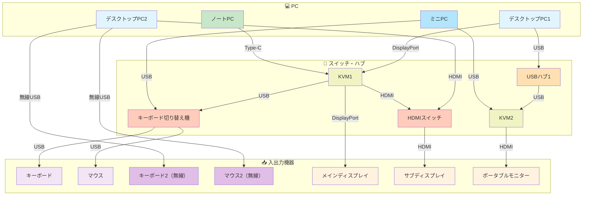

# デスク周りの結線図

## 接続図

## デバイス一覧

| デバイス | 接続方式 | 用途 |
|---------|--------|------|
| デスクトップPC1 | DisplayPort + USB | メイン機器（KVM1経由） |
| デスクトップPC2 | HDMI + 無線USB | サブ機器 |
| ノートPC | Type-C | モバイル機器（KVM1経由） |
| ミニPC | USB（KVM2・切り替え機経由） | 小型機器 |
| KVM1 | - | 入出力切り替え（映像・Type-C） |
| KVM2 | - | 入出力切り替え（USB） |
| USBハブ1 | USB | PC1用ハブ |
| HDMIスイッチ | HDMI入出力 | サブディスプレイ切り替え |
| キーボード切り替え機 | USB入出力 | キーボード・マウス切り替え |
| メインディスプレイ | DisplayPort（KVM1経由） | 4K, 43インチ |
| サブディスプレイ | HDMI（HDMIスイッチ経由） | 共有画面 |
| ポータブルモニター | HDMI（KVM2経由） | サブ画面 |
| キーボード | USB（切り替え機経由） | KVM1経由の入力デバイス |
| マウス | USB（切り替え機経由） | KVM1経由の入力デバイス |
| キーボード2（無線） | 無線USB | PC2専用入力デバイス |
| マウス2（無線） | 無線USB | PC2専用入力デバイス |
